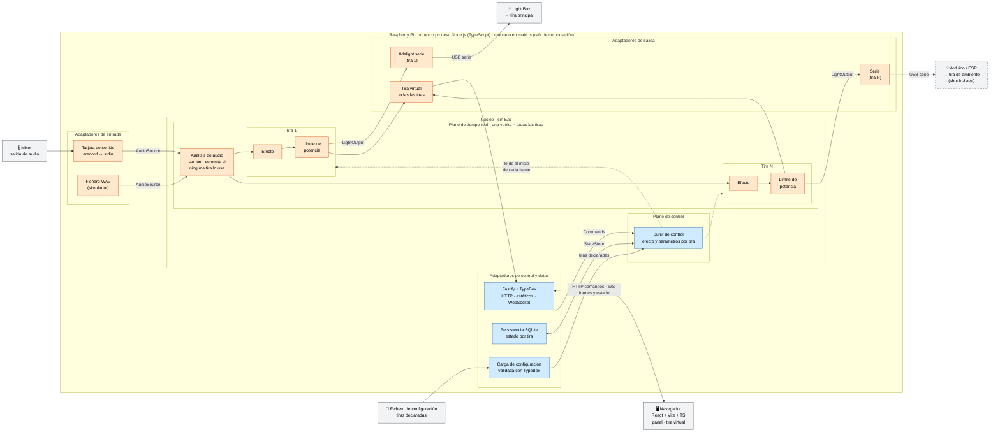
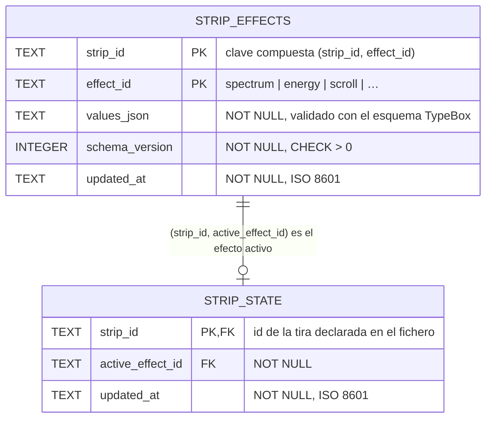

## Índice

0. [Ficha del proyecto](#0-ficha-del-proyecto)
1. [Descripción general del producto](#1-descripción-general-del-producto)
2. [Arquitectura del sistema](#2-arquitectura-del-sistema)
3. [Modelo de datos](#3-modelo-de-datos)
4. [Especificación de la API](#4-especificación-de-la-api)
5. [Historias de usuario](#5-historias-de-usuario)
6. [Tickets de trabajo](#6-tickets-de-trabajo)
7. [Pull requests](#7-pull-requests)

---

## 0. Ficha del proyecto

### **0.1. Tu nombre completo:**

Joseba Alonso

### **0.2. Nombre del proyecto:**

Mood Table

### **0.3. Descripción breve del proyecto:**

Instrumento de luz para la mesa de DJ: un motor de efectos propio, reactivo a la música, que se toca en vivo y funciona sin conexión. En el MVP se controla desde un panel web local; la visión es tocarlo con una pantalla táctil en la mesa o un controlador tipo Traktor F1, que se conectarán al mismo puerto de mandos. Un simulador (audio desde fichero + tira virtual) permite desarrollarlo y demostrarlo sin hardware.

### **0.4. URL del proyecto:**

*Pendiente.* Será la demo pública (el motor reproduciendo un fichero de audio y pintando la tira virtual) y llegará con la entrega final.

> Puede ser pública o privada, en cuyo caso deberás compartir los accesos de manera segura. Puedes enviarlos a [alvaro@lidr.co](mailto:alvaro@lidr.co) usando algún servicio como [onetimesecret](https://onetimesecret.com/).

### 0.5. URL o archivo comprimido del repositorio

https://github.com/7daysofrain/AI4Devs-finalproject

> Puedes tenerlo alojado en público o en privado, en cuyo caso deberás compartir los accesos de manera segura. Puedes enviarlos a [alvaro@lidr.co](mailto:alvaro@lidr.co) usando algún servicio como [onetimesecret](https://onetimesecret.com/). También puedes compartir por correo un archivo zip con el contenido


---

## 1. Descripción general del producto

> Describe en detalle los siguientes aspectos del producto:

### **1.1. Objetivo:**

> Propósito del producto. Qué valor aporta, qué soluciona, y para quién.

**Propósito.** Mood Table convierte la mesa de DJ en un instrumento de luz: la tira LED reacciona a la música que suena y el DJ modula esa reacción en tiempo real, igual que modula el sonido con el mixer.

**Qué soluciona.** Es la reescritura de un proyecto personal (2021-2024) que funcionaba pero era una amalgama de piezas ajenas: Hyperion para el ambiente, dancyPi para la parte reactiva, un orquestador Node que las unía por sockets, y la configuración repartida en cuatro sitios, cada uno con su propia cuenta de LEDs. Añadir un efecto propio obligaba a meterse en las tripas de un tercero. Mood Table lo sustituye por una pieza central propia: un motor con un único modelo de tira y de estado, donde cada efecto es código con sus parámetros declarados.

**Valor.**
- **Efectos propios**, fáciles de crear y de probar.
- **Control en vivo** de los parámetros mientras suena la música.
- **Autonomía**: se enciende la Pi y vuelve como estaba, sin portátil ni internet.
- **Desarrollo y demo sin hardware** gracias al simulador (audio desde fichero + tira virtual).

**Para quién.** DJs y makers con una Raspberry Pi y una tira LED que quieren una iluminación reactiva que puedan tocar y ampliar. El caso de referencia es la mesa del autor, pero nada está atado a ella: el número de LEDs, el orden de color y el límite de potencia se configuran, y los efectos se añaden como módulos de código.

### **1.2. Características y funcionalidades principales:**

> Enumera y describe las características y funcionalidades específicas que tiene el producto para satisfacer las necesidades identificadas.

**MVP (must-have)**

1. **Probar el instrumento en el simulador.** Sin hardware, con un fichero de audio o la tarjeta de sonido como fuente, eliges un efecto y la tira virtual del navegador reacciona a la música en tiempo real.
2. **Tocar los parámetros en vivo.** El panel genera los controles a partir del esquema que declara cada efecto; al moverlos, la luz responde al instante.
3. **Pintar la tira física.** Lo que muestra la tira virtual se reproduce en la tira real de la mesa, conectada al Light Box por protocolo Adalight (serie). Cualquier Arduino con firmware Adalight sirve igual.
4. **Declarar mis tiras.** Las tiras se declaran en un fichero de configuración (salida, número de LEDs, orden de color y límites de potencia), y el motor, el límite de potencia y la tira virtual lo respetan. El sistema admite varias tiras, cada una con su propio efecto.
5. **Arrancar en el último estado.** Enciendes la Pi sin portátil y vuelve como estaba: el efecto de cada tira y sus valores.

**Efectos incluidos.** Los tres efectos de la v1, reescritos en el motor propio. Así se demuestra que la nueva arquitectura cubre lo que hacía la anterior:

- **Espectro:** cada zona de la tira representa una banda de frecuencia.
- **Energía:** el brillo y la extensión de la luz siguen la energía del audio y los golpes.
- **Scroll:** la energía entra por un extremo de la tira y la recorre.

**Should-have**

- **Tira de ambiente:** una segunda tira física con su propio efecto, que no necesita audio (por ejemplo, un color que respira despacio). Es la misma pieza del sistema que la tira principal, con otro efecto: el motor ya pinta varias tiras.
- **Firmware propio** (ESP8266/ESP32): un hardware de referencia barato y muy extendido, con más LEDs y fps de los que permite Adalight y con el camino abierto al WiFi. Es una de las dos formas de conectar la segunda tira; la otra es un Arduino con Adalight.

**Visión (fuera del MVP):** pantalla táctil y Traktor F1 como mandos (sobre el mismo puerto de mandos) · más de dos tiras o segmentos · conexión directa por GPIO de la Pi · WiFi · sincronía por tempo · presets.

### **1.3. Diseño y experiencia de usuario:**

> Proporciona imágenes y/o videotutorial mostrando la experiencia del usuario desde que aterriza en la aplicación, pasando por todas las funcionalidades principales.

### **1.4. Instrucciones de instalación:**
> Documenta de manera precisa las instrucciones para instalar y poner en marcha el proyecto en local (librerías, backend, frontend, servidor, base de datos, migraciones y semillas de datos, etc.)

---

## 2. Arquitectura del Sistema

### **2.1. Diagrama de arquitectura:**
> Usa el formato que consideres más adecuado para representar los componentes principales de la aplicación y las tecnologías utilizadas. Explica si sigue algún patrón predefinido, justifica por qué se ha elegido esta arquitectura, y destaca los beneficios principales que aportan al proyecto y justifican su uso, así como sacrificios o déficits que implica.

Mood Table es **un único proceso Node.js (TypeScript)** que corre en la Raspberry Pi de la mesa. En su centro está el **motor**: un bucle que, en cada frame, analiza el audio una vez y pinta **todas las tiras declaradas**, cada una con su propio efecto, su límite de potencia y su salida. Todo lo que toca el mundo exterior (la tarjeta de sonido, los puertos serie, el navegador, el disco, el fichero de configuración) está fuera del núcleo, en adaptadores que se conectan a él por interfaces.



*Naranja: plano de tiempo real. Azul: plano de control y datos. Gris: fuera del proceso. Discontinuo: should-have. El MVP se demuestra con una tira física (la del Light Box) y la tira virtual; el modelo admite N tiras.*

#### Patrón: hexagonal ligera (puertos y adaptadores)

El núcleo define **cuatro puertos** (interfaces de TypeScript) y no sabe qué hay detrás de ninguno:

| Puerto | Para qué | Adaptadores en el MVP | Adaptadores previstos |
|---|---|---|---|
| `AudioSource` | Entregar muestras de audio | Tarjeta de sonido (`arecord` → `stdin`) · Fichero WAV | — |
| `LightOutput` | Recibir los frames de una tira | Adalight por serie (una instancia por tira) · Tira virtual (WebSocket, todas las tiras) | Firmware propio ESP8266/ESP32 (should-have) |
| `Commands` | Cambiar el efecto y los parámetros de una tira | API HTTP del panel | Traktor F1 (HID) · pantalla táctil |
| `StateStore` | Guardar y recuperar el estado de cada tira | SQLite (ver §3) · En memoria (tests) | — |

Es una versión **ligera** de la hexagonal: los adaptadores se crean y se conectan **a mano** en un único punto de arranque (`main.ts`, la *raíz de composición*), que lee el fichero de configuración y decide, por ejemplo, "fuente = fichero, tira 1 → Adalight en `/dev/ttyUSB0`, todas → tira virtual". **No hay contenedor de inyección de dependencias**, ni capas de casos de uso, ni mapeo de DTOs.

Dentro del proceso conviven **dos planos** con reglas distintas:

- **Plano de tiempo real** (naranja): audio → análisis → efecto de cada tira → límite de potencia de cada tira → salidas, a 30-60 fps. No puede retrasarse: trabaja con búferes preasignados y sin crear objetos en el bucle.
- **Plano de control** (azul): panel, API, configuración y persistencia. Puede ser lento, pero no debe estorbar: sus cambios se escriben en un **búfer de control** que el bucle lee **al inicio de cada frame**, nunca a mitad de un render.

**Reactivo o ambiente es cosa del efecto, no de la tira.** Todos los efectos implementan la misma interfaz y declaran si usan audio (patrón *Strategy*). Un efecto reactivo lee los rasgos del audio; uno de ambiente anima con el tiempo y los ignora. Cualquier efecto va en cualquier tira.

#### Justificación

- **Los puertos los pide el hardware, no la teoría.** Cada puerto tiene al menos dos implementaciones reales (tarjeta o fichero; Light Box o navegador; panel o F1). Sin la separación, el motor quedaría acoplado a ALSA, a los puertos serie y al navegador.
- **La tira es una entidad desde el principio.** La mesa real tiene dos tiras (una reactiva y otra de ambiente). Diseñar el bucle, los datos y la API para N tiras cuesta ahora lo mismo que para una, y evita rehacerlos cuando llegue la segunda.
- **Cada dato donde le corresponde.** Lo que sale de la hoja de características del hardware y no cambia (salida, número de LEDs, orden de color, límites de potencia) se **declara en un fichero de configuración** versionado y validado al arrancar. Lo que cambia mientras se toca (efecto activo y valores de cada tira) va en la **base de datos**. Una tira existe porque está cableada, así que no se da de alta desde el panel.
- **El simulador no es una pieza aparte.** Es el mismo motor con otros adaptadores (fichero WAV + tira virtual). Lo que se ve en la demo pública es exactamente el código que corre en la mesa.
- **El motor funciona sin audio.** Si ninguna tira tiene un efecto reactivo, el análisis se omite y la mesa puede quedarse en modo ambiente sin música.
- **Librería en el borde, no framework en el centro.** El servidor HTTP (Fastify) es un adaptador más. Se descartaron frameworks *full-stack* como AdonisJS porque imponen su estructura y su ciclo de vida alrededor de una aplicación web, y aquí el centro es un bucle de tiempo real. Se descartó también un contenedor de DI: son pocas dependencias elegidas una vez al arrancar, y no justifica la "magia" de decoradores y metadatos.
- **Un solo proceso, no servicios separados.** Un usuario, una Pi y latencia crítica: repartir el sistema en servicios solo añadiría red y puntos de fallo entre el mando y la luz.

**Stack:**

| Pieza | Tecnología | Por qué |
|---|---|---|
| Motor | TypeScript sobre Node.js (arm64) | El autor puede leer y corregir lo que genera el agente; tipos compartidos con el front. Condicionado a un spike de rendimiento en la Pi. |
| Panel y tira virtual | React + Vite + TypeScript | Stack conocido; comparte tipos (esquemas de parámetros) con el motor. El motor sirve el build estático: no hay servidor aparte. |
| API | Fastify + TypeBox | Un solo esquema da el tipo de TypeScript, la validación y el OpenAPI (§4). El mismo esquema describe los parámetros de cada efecto y el fichero de configuración. |
| Transporte | HTTP para comandos · WebSocket (motor → navegador) para frames binarios y estado | HTTP se documenta en OpenAPI; el WebSocket lleva el flujo continuo (300 LEDs × 3 bytes × 60 fps ≈ 54 KB/s por tira). |
| Persistencia | SQLite tras el puerto `StateStore` | Transacciones seguras ante cortes de luz (§3). |
| Salida física | Protocolo Adalight por serie | Protocolo abierto que ya hablan el Light Box de la mesa y cualquier Arduino con el sketch Adalight. Sin GPIO ni software de terceros. |

#### Beneficios

- **Testabilidad determinista:** con fuente = fichero y salida = memoria, un efecto produce siempre los mismos frames, así que se puede comparar contra frames de referencia ("frames dorados").
- **Desarrollo y demo sin hardware:** el simulador sale gratis de la arquitectura.
- **Extensible sin tocar el núcleo:** una tira nueva es una entrada en el fichero de configuración; la F1, la pantalla táctil o el firmware propio son adaptadores nuevos. El motor no cambia.
- **Una sola fuente de verdad** para los esquemas: panel, API, configuración y documentación salen del mismo sitio.
- **Despliegue simple:** un proceso bajo `systemd` en la Pi, que arranca solo y recupera el último estado.

#### Sacrificios y déficits

- **Un solo hilo compartido.** El bucle de frames y las peticiones HTTP se turnan en el mismo *event loop* de Node: una petición lenta retrasaría un frame. Mitigación: el plano de control solo escribe en el búfer. Si el spike mostrara tirones, el motor pasaría a un *worker thread*.
- **Recolector de basura.** Node puede pausar para liberar memoria y provocar tirones. Mitigación: búferes preasignados y cero asignaciones en el bucle.
- **Latencia de HTTP en los sliders.** Mover un parámetro por HTTP es algo más lento que por WebSocket (milisegundos en red local; el panel limita el envío mientras arrastras). Si en uso real no se siente inmediato, `setParam` pasaría a WebSocket; el cambio es acotado porque `Commands` es un puerto.
- **Techo de Adalight por tira.** A 115.200 baudios, unos 19 fps con 200 LEDs en cada puerto serie. Limita el número de LEDs por tira en el MVP (≤ 200-300); el firmware propio es la salida.
- **Cambiar el hardware exige reiniciar.** La configuración de las tiras se lee al arrancar. Es aceptable en un aparato que se cablea una vez.
- **Sin clave foránea hacia las tiras.** Como las tiras viven en el fichero, la base de datos no puede apuntar a ellas. Al arrancar, el motor **reconcilia**: crea el estado de las tiras nuevas e ignora el de las que ya no existen.
- **Montaje manual.** Sin contenedor, `main.ts` crece con cada adaptador nuevo. Aceptable con el número de piezas previsto.
- **Proceso único = punto único de fallo.** Si el proceso cae, se apaga todo. `systemd` lo reinicia y vuelve al último estado guardado.

### **2.2. Descripción de componentes principales:**

> Describe los componentes más importantes, incluyendo la tecnología utilizada

*El porqué de cada tecnología está en §2.1. Aquí se describe qué hace cada componente por dentro. Es el diseño previsto para la Entrega 2.*

#### Núcleo (motor)

**Bucle de frames** — TypeScript, sin dependencias de E/S.
Marca el ritmo del sistema a una tasa objetivo configurable (30-60 fps). En cada vuelta: (1) lee el búfer de control, (2) si alguna tira tiene un efecto que usa audio, pide al análisis los rasgos del audio más reciente, y (3) para **cada tira declarada** llama a su efecto, aplica su límite de potencia y entrega el frame a su salida y a la tira virtual. Mide cuánto tarda cada vuelta; si llega tarde, **se salta el frame en lugar de acumular retraso**, porque en luz en vivo importa más ir a tiempo que no perder ninguno. Cada tira tiene su búfer preasignado (`Uint8Array` de `LEDs × 3`) y no se crean objetos dentro del bucle, para evitar pausas del recolector de basura.

**Análisis de audio** — TypeScript + FFT (`fft.js` o implementación propia; se decide en el spike de rendimiento).
Recibe muestras PCM de la fuente de audio en un búfer circular. Cuando alguna tira lo necesita, aplica una ventana y una FFT sobre las últimas muestras y calcula los **rasgos** que consumen los efectos: energía por bandas de frecuencia (repartidas en escala logarítmica, como el oído), energía total y detección de golpes (un golpe es un salto de energía por encima de su media reciente). Se calcula **una vez por frame** y lo comparten todas las tiras. Si ninguna tira usa audio, no se calcula, y el motor puede funcionar sin fuente de audio.

**Efectos** — módulos de TypeScript con esquema TypeBox.
Cada efecto es un módulo con la misma forma, sea reactivo o de ambiente (patrón *Strategy*):

```ts
interface Effect<P, S> {
  id: string;                     // "spectrum", "energy", "scroll", …
  usesAudio: boolean;             // declarado: reactivo (true) o ambiente (false)
  paramsSchema: TSchema;          // TypeBox: tipos, rangos y valores por defecto
  createState(strip: StripConfig): S;
  render(ctx: FrameContext, params: P, state: S, out: Uint8Array): void;
}
// FrameContext = { time, dt, audio }: el ambiente anima con el tiempo; el reactivo, además, con el audio
```

El **esquema** es lo que permite que el panel genere los controles sin conocer el efecto y que la API rechace un valor fuera de rango. El **estado explícito** (lo que el efecto recuerda entre frames, como la posición del scroll o el suavizado) es **por tira**, y hace que, con la misma entrada, un efecto produzca siempre los mismos frames, así que se puede testear. `usesAudio` le dice al panel cómo etiquetar el efecto y al bucle si hace falta analizar el audio. El MVP incluye tres efectos reactivos: **espectro**, **energía** y **scroll** (los de la v1, reescritos).

**Límite de potencia** — TypeScript, uno por tira.
Estima el consumo del frame a partir del valor de cada canal y del consumo máximo por LED declarado para esa tira. Si supera el límite configurado para su fuente de alimentación, escala el brillo de todo el frame en proporción. Protege fuentes y tiras, algo que en la v1 hacían por debajo piezas de terceros.

**Búfer de control** — TypeScript.
Guarda lo que el bucle necesita **de cada tira**: efecto activo y valores de sus parámetros. Los comandos que llegan del plano de control (ya validados) se escriben aquí, y el bucle los recoge al inicio del frame siguiente. Cada cambio avisa al puerto de persistencia, que guarda con un pequeño retardo (agrupa los cambios mientras se arrastra un slider en lugar de escribir en disco cien veces).

#### Configuración de las tiras

**Carga de configuración** — TypeScript + TypeBox.
Al arrancar, lee el fichero de configuración del despliegue, que declara las tiras (identificador, nombre, salida y puerto, número de LEDs, orden de color y límites de potencia) y la fuente de audio. Lo valida contra su esquema TypeBox: si algo está mal, **el motor no arranca** y dice exactamente qué campo falla. Después **reconcilia** con la base de datos: crea el estado de las tiras nuevas (con su primer efecto y valores por defecto) e ignora el de las que ya no están declaradas.

#### Adaptadores

| Adaptador | Puerto | Tecnología | Qué hace |
|---|---|---|---|
| **Tarjeta de sonido** | `AudioSource` | `arecord` (ALSA) como proceso hijo | Lee PCM crudo (16 bits, mono) por `stdout`. Sin binarios nativos en Node. |
| **Fichero WAV** | `AudioSource` | Lector WAV en TypeScript | Entrega las muestras al mismo ritmo que si sonaran en tiempo real, en bucle. Es la fuente del simulador y de los tests. |
| **Adalight serie** | `LightOutput` | `serialport` | Una instancia **por tira física**, en su puerto. Añade la cabecera Adalight (`Ada` + número de LEDs + checksum), reordena los canales según el orden de color de la tira (RGB, GRB…) y escribe por USB serie. Si el puerto sigue ocupado con el frame anterior, descarta el nuevo en lugar de encolarlo. |
| **Tira virtual** | `LightOutput` | WebSocket (`@fastify/websocket`) | Envía los frames de **todas las tiras** en binario a los navegadores conectados, junto con los cambios de estado. |
| **API HTTP** | `Commands` | Fastify + TypeBox | Rutas para listar las tiras (solo lectura) y los efectos con sus esquemas, y para cambiar el efecto y los parámetros de una tira. Valida cada petición y publica el OpenAPI. También sirve el build del panel. |
| **Persistencia** | `StateStore` | SQLite (§3) · en memoria para tests | Guarda y carga el estado de cada tira: efecto activo y valores de cada efecto. Al arrancar, el motor recupera el último estado desde aquí. |

**Raíz de composición (`main.ts`).** Carga la configuración, crea los adaptadores que indica (fuente de audio, una salida por tira, tira virtual, API, persistencia), los conecta al núcleo y arranca el bucle. Es el único punto del código que conoce todas las piezas.

#### Panel y tira virtual (front)

**Tecnología:** React + Vite + TypeScript, servido por el propio motor. No contiene lógica de luces: solo muestra y envía comandos.

- **Selector de tira:** lista las tiras declaradas; lo que se toca se aplica a la tira seleccionada.
- **Panel de control:** muestra los efectos, etiquetados como reactivos o de ambiente, y **genera los controles a partir del esquema** del efecto activo de la tira (un número con rango se convierte en slider, un color en selector de color, una lista de opciones en desplegable). Al mover un control, envía el cambio por HTTP, limitando la frecuencia de envío mientras se arrastra.
- **Tira virtual:** recibe los frames binarios por WebSocket y dibuja **todas las tiras** en un `<canvas>`, un punto de luz por LED, con la geometría declarada en la configuración.

**Tipos compartidos.** Los esquemas TypeBox (efectos, comandos, configuración de las tiras) viven en un paquete común que importan el motor y el panel. Si cambia un parámetro, el compilador avisa en los dos lados.

### **2.3. Descripción de alto nivel del proyecto y estructura de ficheros**

> Representa la estructura del proyecto y explica brevemente el propósito de las carpetas principales, así como si obedece a algún patrón o arquitectura específica.

*Estructura prevista para la Entrega 2.*

El repositorio es un **monorepo con pnpm workspaces** y tres paquetes: `engine` (el motor), `panel` (el front) y `shared` (los esquemas comunes). Se descartó un único paquete porque con paquetes separados la frontera entre motor y navegador la impone la estructura: el panel **solo puede importar lo que exporta `shared`**, así que no puede acabar lógica de luces en el navegador. Además, cada lado tiene sus dependencias y su configuración de TypeScript (Node frente a DOM), y en la Pi solo se instala el motor. No se usa Nx ni Turborepo porque con tres paquetes no aportan nada que los workspaces no den ya.

```
AI4Devs-finalproject/
├── packages/
│   ├── shared/     # Esquemas TypeBox comunes: parámetros de efectos, comandos, config de la tira, formato de frames
│   ├── engine/     # Motor (un proceso Node en la Pi): núcleo y adaptadores, separados
│   └── panel/      # Front (React + Vite): panel de control y tira virtual
├── e2e/            # Tests E2E (Playwright) del flujo principal
├── firmware/       # (should-have) Firmware C++ para ESP8266/ESP32
├── openspec/       # Specs de SDD: specs vivas y cambios propuestos
├── deploy/         # Servicio systemd y ficheros de configuración de tiras (mesa y demo pública)
├── docs/           # Documentación de apoyo (ficha, decisiones)
├── .claude/        # Skills y subagentes de Claude Code
└── AGENTS.md       # Instrucciones para agentes de código (estándar abierto)
```

**Cómo refleja la arquitectura hexagonal (§2.1):**

- Dentro de **`engine`**, el **núcleo** (bucle, análisis de audio, efectos y los **puertos**, que son interfaces del núcleo) y los **adaptadores** (audio, luz, HTTP, persistencia) viven en carpetas separadas. El núcleo no conoce ALSA, el puerto serie, Fastify ni el disco; añadir la F1 o el firmware propio es añadir un adaptador.
- Solo la **raíz de composición** conoce a la vez el núcleo y los adaptadores.
- La regla "el núcleo no importa de los adaptadores" se comprueba con una **regla de lint** (restricción de rutas de import), así que no depende de la disciplina de quien escriba el código, sea persona o agente.

**Por qué un efecto vive en dos paquetes:** su **esquema** de parámetros está en `shared`, porque lo necesitan el panel (para generar controles) y la API (para validar). Su **render** está en `engine`, porque es lógica de luces y el navegador no debe tenerla.

**Carpetas fuera de los workspaces:**

- `e2e/`: los tests del flujo completo arrancan el motor con fuente = fichero y comprueban en el navegador que la tira virtual reacciona y que mover un control cambia la luz.
- `firmware/`: proyecto C++ independiente (should-have).
- `openspec/`: las specs que guían cada cambio (Spec-Driven Development).
- `.claude/` y `AGENTS.md`: la configuración del agente de código es parte de la evidencia del uso de IA (ver `prompts.md`). Donde existe un estándar se usa: las instrucciones del proyecto van en **`AGENTS.md`**, que leen distintas herramientas (Claude Code lo recibe a través de un `CLAUDE.md` que lo importa). Donde no existe, se usa la ubicación de la herramienta: las skills (por ejemplo, "nuevo efecto") y los subagentes (por ejemplo, revisión contra spec) van en `.claude/`, que es donde Claude Code los busca.

### **2.4. Infraestructura y despliegue**

> Detalla la infraestructura del proyecto, incluyendo un diagrama en el formato que creas conveniente, y explica el proceso de despliegue que se sigue

### **2.5. Seguridad**

> Enumera y describe las prácticas de seguridad principales que se han implementado en el proyecto, añadiendo ejemplos si procede

*Diseño previsto para la Entrega 2.*

La seguridad se plantea **por contexto**, porque el riesgo no es el mismo en la mesa que en internet. Buena parte la resuelven decisiones de arquitectura, sin código adicional.

#### En la mesa (red local)

- **Sin autenticación, por decisión explícita.** Es una red doméstica de confianza, el sistema no guarda datos personales y el peor caso es que alguien de la casa cambie las luces. Queda fuera del MVP.
- **La API no puede tocar el hardware.** Las tiras (puertos, número de LEDs, límites de potencia) se declaran en el fichero de configuración, no en la base de datos (§3). Desde la red solo se puede cambiar el efecto y sus parámetros, nunca a qué puerto se escribe ni cuánta corriente se permite.
- **El proceso no corre como root.** Se ejecuta con un usuario propio que solo tiene acceso a los puertos serie (grupo `dialout`). Es una de las razones para descartar la conexión por GPIO, que exige root.

#### En la demo pública (internet)

- **Estado compartido y volátil.** La demo usa el adaptador de persistencia **en memoria**: nada se escribe en disco y el estado vuelve al inicial cada cierto tiempo. Todos los visitantes ven la misma tira virtual; que uno vea lo que toca otro se asume como parte de la demo.
- **Sin hardware.** La configuración de la demo solo declara tiras virtuales, así que no hay puertos serie expuestos.
- **Límite de peticiones** por IP en la API (`@fastify/rate-limit`) y **máximo de conexiones WebSocket** simultáneas.
- **HTTPS** proporcionado por la plataforma de despliegue (§2.4).

#### En todo el sistema

- **Validación de todas las entradas** con los esquemas TypeBox: tipos, rangos y rechazo de campos desconocidos. Un parámetro fuera de rango se rechaza antes de llegar al motor. El fichero de configuración se valida igual al arrancar.
- **Mismo origen:** el panel lo sirve el propio motor, así que no se abre CORS.
- **Cabeceras de seguridad** HTTP con `@fastify/helmet`.
- **Tamaño máximo** de los mensajes WebSocket entrantes.
- **Sin secretos:** el sistema no necesita claves ni credenciales. No hay login: el README lo indica expresamente en las instrucciones de prueba.

#### Análisis automático en cada PR

El código lo escribe en buena parte un agente, así que el análisis automático es **una puerta más** antes de aceptar un cambio, junto a los tests y el simulador.

| Herramienta | Qué revisa | Cómo actúa |
|---|---|---|
| **SonarQube Cloud** (plan gratuito para proyectos públicos) | Bugs, vulnerabilidades y *security hotspots* en el código, *code smells*, duplicados y cobertura de tests | **Quality gate** en cada PR: si el código nuevo no la supera, el PR no se integra |
| **Dependabot** (GitHub) | Vulnerabilidades conocidas en las dependencias | Alertas y PRs automáticos de actualización. Cubre lo que el plan gratuito de Sonar no analiza |

### **2.6. Tests**

> Describe brevemente algunos de los tests realizados

---

## 3. Modelo de Datos

*Diseño previsto para la Entrega 2.*

**Regla de reparto:** lo que sale de la hoja de características del hardware y no cambia se **declara en un fichero de configuración**; lo que cambia mientras se toca el instrumento se guarda en la **base de datos**.

| Dato | Ejemplos | Dónde vive | Quién lo cambia |
|---|---|---|---|
| **Declaración de las tiras** | salida y puerto, nº de LEDs, orden de color, límites de potencia | Fichero de configuración del despliegue (versionado, validado con TypeBox al arrancar) | El maker, al cablear; se aplica al reiniciar |
| **Estado del instrumento** | efecto activo de cada tira y valores de sus parámetros | Base de datos SQLite | El DJ, desde el panel, mientras toca |
| **Definición de los efectos** | parámetros, tipos, rangos, `render` | Código (§2.2) | El desarrollador |

Una tira existe porque está cableada, así que no se da de alta desde el panel. Y la definición de un efecto es código, así que no se duplica en la base de datos: **el código define, la base de datos guarda lo que decide el usuario.**

**Motor de persistencia: SQLite**, detrás del puerto `StateStore` (§2.1). La razón principal no es la rúbrica sino el aparato: **la Pi de una mesa de DJ se desenchufa sin apagarla**. Con las transacciones de SQLite, un corte de luz a mitad de un guardado deja el dato anterior o el nuevo, nunca uno a medias, y el arranque en el último estado (H5) sigue funcionando. Además, las restricciones viven en el esquema y los cambios se versionan con migraciones. Se descartó un fichero JSON: habría que implementar a mano la escritura segura y el modelo quedaría sin claves ni restricciones.

Hay dos adaptadores del puerto: **SQLite** (producción y demo) y **en memoria** (tests). La base de datos es un único fichero en la Pi, sin servidor.

### **3.1. Diagrama del modelo de datos:**

> Recomendamos usar mermaid para el modelo de datos, y utilizar todos los parámetros que permite la sintaxis para dar el máximo detalle, por ejemplo las claves primarias y foráneas.



### **3.2. Descripción de entidades principales:**

> Recuerda incluir el máximo detalle de cada entidad, como el nombre y tipo de cada atributo, descripción breve si procede, claves primarias y foráneas, relaciones y tipo de relación, restricciones (unique, not null…), etc.

#### `strip_state` — estado de cada tira (H5)

Lo que el motor restaura al arrancar: qué efecto tenía cada tira. Una fila por tira declarada.

| Atributo | Tipo | Restricciones | Descripción |
|---|---|---|---|
| `strip_id` | TEXT | PK | Identificador de la tira tal como aparece en el fichero de configuración (por ejemplo, `principal`). |
| `active_effect_id` | TEXT | NOT NULL; FK compuesta `(strip_id, active_effect_id)` → `strip_effects (strip_id, effect_id)` | Efecto activo de la tira. La FK compuesta garantiza que el efecto activo **siempre tiene valores guardados para esa tira**. |
| `updated_at` | TEXT | NOT NULL | Fecha del último cambio (ISO 8601). |

#### `strip_effects` — valores de cada efecto en cada tira (H2)

Una fila por cada combinación de tira y efecto. Guarda los valores **de todos los efectos**, no solo del activo: al volver a un efecto, la tira recupera cómo lo dejaste. Y son **por tira**: el mismo efecto puede tener valores distintos en una tira de 50 LEDs y en otra de 200.

| Atributo | Tipo | Restricciones | Descripción |
|---|---|---|---|
| `strip_id` | TEXT | PK (compuesta) | Tira a la que pertenecen los valores. |
| `effect_id` | TEXT | PK (compuesta) | Identificador del efecto (`spectrum`, `energy`, `scroll`…). |
| `values_json` | TEXT | NOT NULL | Valores de los parámetros en JSON. Se validan contra el esquema TypeBox del efecto al leer y al escribir. |
| `schema_version` | INTEGER | NOT NULL, `CHECK > 0` | Versión del esquema del efecto con la que se guardaron los valores. Si el esquema cambia, los valores se migran o se sustituyen por los valores por defecto. |
| `updated_at` | TEXT | NOT NULL | Fecha de la última modificación. |

**Relación:** `strip_effects` 1 — 0..1 `strip_state`. El estado de una tira apunta siempre a exactamente una fila de sus valores; cada fila de valores es la del efecto activo (1) o no (0). La clave foránea se hace cumplir con `PRAGMA foreign_keys = ON`.

**Por qué los valores van en una columna JSON y no en una fila por parámetro:** la definición de los parámetros (tipo, rango, valor por defecto) pertenece al código del efecto, en su esquema TypeBox. La base de datos solo guarda valores. Una fila por parámetro obligaría a duplicar en tablas lo que ya define el esquema y a guardar valores de tipos distintos (número, color, opción) en una misma columna. La integridad de los valores la garantiza la validación con el esquema.

#### Tira declarada — en el fichero de configuración, no en la base de datos (H4)

Se documenta aquí porque es la otra mitad del modelo. Su esquema TypeBox vive en el paquete compartido y se valida al arrancar.

| Campo | Tipo | Restricciones | Descripción |
|---|---|---|---|
| `id` | string | Obligatorio, único en el fichero | Identificador estable de la tira; es el `strip_id` de la base de datos. |
| `name` | string | Obligatorio | Nombre que muestra el panel. |
| `output` | objeto | Obligatorio | Tipo de salida (`adalight`, `virtual`) y puerto serie si aplica (por ejemplo, `/dev/ttyUSB0`). |
| `ledCount` | entero | > 0 | Número de LEDs. El máximo práctico con Adalight es ≈ 200-300 por tira. |
| `colorOrder` | enum | RGB, RBG, GRB, GBR, BRG, BGR | Orden de los canales que espera la tira. |
| `maxCurrentMa` | entero | > 0 | Consumo máximo permitido (mA) según su fuente de alimentación. Lo usa el límite de potencia. |
| `ledMaxMa` | entero | > 0, por defecto 60 | Consumo de un LED en blanco a máximo brillo (mA), para estimar el consumo de cada frame. |

#### Reconciliación al arrancar

Como las tiras viven en el fichero, la base de datos no puede tener una clave foránea hacia ellas. La sustituye una reconciliación al arrancar, dentro de una transacción:

- **Tira nueva en el fichero:** se crean sus filas en `strip_effects` con los valores por defecto de cada efecto y su `strip_state` con el primer efecto.
- **Efecto nuevo en el código:** se crea su fila en `strip_effects` para cada tira, con sus valores por defecto.
- **Tira que ya no está en el fichero:** su estado se ignora (no se borra, por si vuelve a declararse).

#### Garantías y evolución del esquema

- **Durabilidad ante cortes de luz:** SQLite en modo WAL con `synchronous = FULL`; cada guardado es una transacción. El guardado se agrupa con un pequeño retardo (§2.2) para no escribir en la tarjeta SD con cada movimiento de un slider.
- **Migraciones versionadas:** el esquema se crea y evoluciona con migraciones numeradas que se aplican al arrancar; una tabla de control registra cuáles se han aplicado.
- **Sin datos personales:** la base de datos no guarda nada de usuarios, solo el estado del aparato.

#### Cómo se prueba la persistencia

1. **Tests de contrato del puerto:** el mismo conjunto de tests se ejecuta contra el adaptador SQLite y contra el adaptador en memoria. Guardar y leer devuelve lo mismo, y los valores fuera de esquema se rechazan.
2. **Tests de restricciones:** SQLite rechaza lo que el esquema prohíbe (un efecto activo sin valores guardados para esa tira, una versión de esquema no positiva).
3. **Test de reconciliación:** se añade y se quita una tira del fichero de configuración, se arranca, y se comprueba el estado resultante.
4. **Test de arranque tras corte:** se arranca el motor, se cambian el efecto y los parámetros de una tira por la API, **se mata el proceso sin cerrarlo** (`kill -9`, que simula desenchufar), se vuelve a arrancar y se comprueba que la API devuelve el mismo estado.
5. **Comprobación manual:** la base de datos se puede inspeccionar con `sqlite3` (por ejemplo, `SELECT * FROM strip_state;`).

---

## 4. Especificación de la API

> Si tu backend se comunica a través de API, describe los endpoints principales (máximo 3) en formato OpenAPI. Opcionalmente puedes añadir un ejemplo de petición y de respuesta para mayor claridad

---

## 5. Historias de Usuario

> Documenta 3 de las historias de usuario principales utilizadas durante el desarrollo, teniendo en cuenta las buenas prácticas de producto al respecto.

**Historia de Usuario 1**

**Historia de Usuario 2**

**Historia de Usuario 3**

---

## 6. Tickets de Trabajo

> Documenta 3 de los tickets de trabajo principales del desarrollo, uno de backend, uno de frontend, y uno de bases de datos. Da todo el detalle requerido para desarrollar la tarea de inicio a fin teniendo en cuenta las buenas prácticas al respecto. 

**Ticket 1**

**Ticket 2**

**Ticket 3**

---

## 7. Pull Requests

> Documenta 3 de las Pull Requests realizadas durante la ejecución del proyecto

**Pull Request 1**

**Pull Request 2**

**Pull Request 3**

