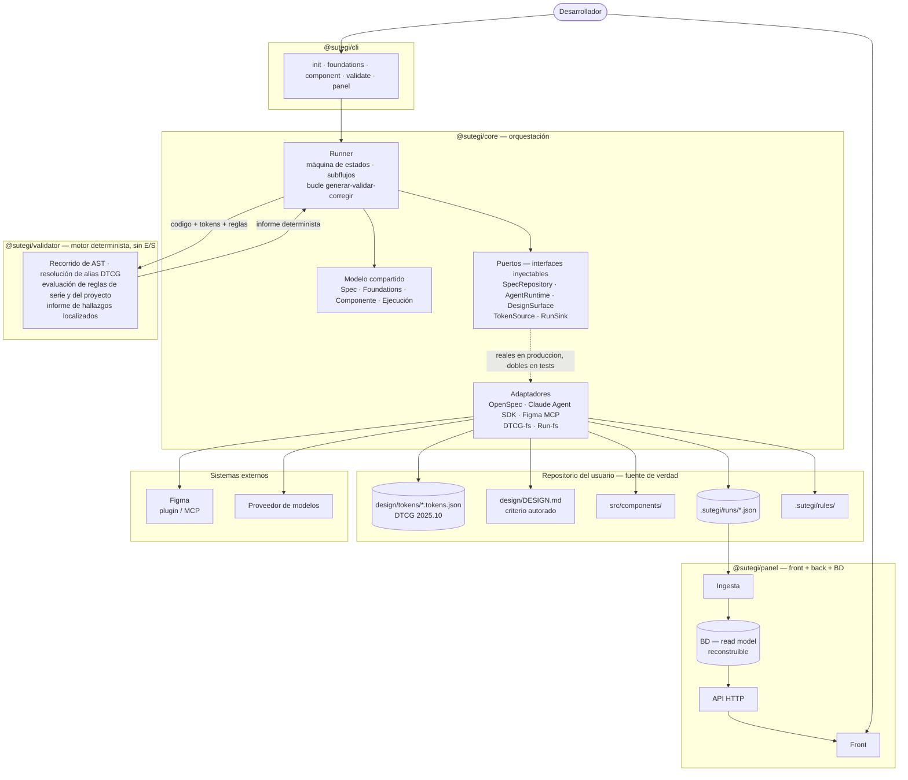
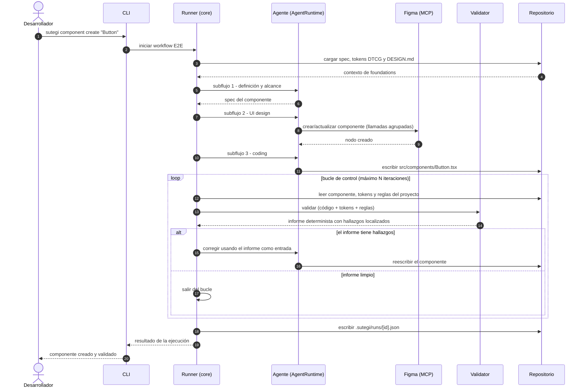

## Índice

0. [Ficha del proyecto](#0-ficha-del-proyecto)
1. [Descripción general del producto](#1-descripción-general-del-producto)
2. [Arquitectura del sistema](#2-arquitectura-del-sistema)
3. [Modelo de datos](#3-modelo-de-datos)
4. [Especificación de la API](#4-especificación-de-la-api)
5. [Historias de usuario](#5-historias-de-usuario)
6. [Tickets de trabajo](#6-tickets-de-trabajo)
7. [Pull requests](#7-pull-requests)

---

## 0. Ficha del proyecto

### **0.1. Tu nombre completo:**

### **0.2. Nombre del proyecto:**

### **0.3. Descripción breve del proyecto:**

### **0.4. URL del proyecto:**

> Puede ser pública o privada, en cuyo caso deberás compartir los accesos de manera segura. Puedes enviarlos a [alvaro@lidr.co](mailto:alvaro@lidr.co) usando algún servicio como [onetimesecret](https://onetimesecret.com/).

### 0.5. URL o archivo comprimido del repositorio

> Puedes tenerlo alojado en público o en privado, en cuyo caso deberás compartir los accesos de manera segura. Puedes enviarlos a [alvaro@lidr.co](mailto:alvaro@lidr.co) usando algún servicio como [onetimesecret](https://onetimesecret.com/). También puedes compartir por correo un archivo zip con el contenido


---

## 1. Descripción general del producto

> Describe en detalle los siguientes aspectos del producto:

### **1.1. Objetivo:**

> Propósito del producto. Qué valor aporta, qué soluciona, y para quién.

### **1.2. Características y funcionalidades principales:**

> Enumera y describe las características y funcionalidades específicas que tiene el producto para satisfacer las necesidades identificadas.

### **1.3. Diseño y experiencia de usuario:**

> Proporciona imágenes y/o videotutorial mostrando la experiencia del usuario desde que aterriza en la aplicación, pasando por todas las funcionalidades principales.

### **1.4. Instrucciones de instalación:**
> Documenta de manera precisa las instrucciones para instalar y poner en marcha el proyecto en local (librerías, backend, frontend, servidor, base de datos, migraciones y semillas de datos, etc.)

---

## 2. Arquitectura del Sistema

### **2.1. Diagrama de arquitectura:**

#### Vista de contenedores



#### Qué patrón sigue

Sutegi no sigue *un* patrón: los que aplica operan en **niveles de abstracción distintos** y por
tanto no compiten entre sí. La arquitectura se declara por niveles:

| Nivel | Qué decide | Patrón elegido |
|---|---|---|
| **0. Organización del código** | Un repositorio o varios | **Monorepo** de cuatro paquetes |
| **1. Descomposición del sistema** | En qué piezas ejecutables se parte | **Paquetes por capacidad**: `core` (orquestación), `validator` (criterio), `cli` (interfaz), `panel` (observabilidad) |
| **2. Estructura interna de cada pieza** | Cómo se organiza cada una por dentro | `core`: **puertos e inyección de dependencias** · `validator`: **motor de reglas** sobre AST · `panel`: **arquitectura por capas** |
| **3. Comportamiento en ejecución** | Cómo interactúan mientras corren | **Bucle de control cerrado** (*generate-and-test*) con verificador determinista externo |

**El patrón que define este sistema es el del nivel 3.** Los niveles 0 a 2 son decisiones
convencionales y bien resueltas por la industria; el bucle de control es lo que hace que Sutegi sea
lo que es, y por eso encabeza la justificación.

#### Justificación

**1. El bucle de control cerrado: la tesis del proyecto.** Un agente que genera un componente y
luego se autoevalúa está juzgando con la misma facultad con la que produjo el error. Aquí el
veredicto lo emite un **verificador determinista y externo al modelo**: el motor recorre el AST del
componente, resuelve los alias de los tokens DTCG y comprueba el resultado contra las foundations
declaradas. Lo que devuelve no es una puntuación, es una lista de hallazgos localizados — y
**vuelve a entrar al agente como entrada de la siguiente iteración**.



Esto es lo que sitúa a Sutegi frente al estado del arte. Las herramientas del espacio —Tidy,
FigmaLint— **puntúan con IA y desde el lado de Figma**; aquí **falla un test sobre el código**. Y
`lifesized/figma-design-sync`, la más cercana, declara explícitamente que no cubre gobernanza, ni
panel, ni framework de validación: justo las tres piezas del MVP.

**2. Puertos e inyección de dependencias en `core` — y por qué NO arquitectura hexagonal completa.**
El runner necesita hablar con cinco cosas que están fuera del proceso: el formato de spec, el
runtime de agentes, la superficie de diseño, los ficheros de tokens y el destino de los artefactos
de ejecución. Cada una se declara como una **interfaz que se inyecta**, y de cada una hay dos
implementaciones: la real y un doble de pruebas.

| Puerto | Adaptador real | Doble en tests |
|---|---|---|
| `SpecRepository` | OpenSpec en ficheros | Specs en memoria |
| `AgentRuntime` | Claude Agent SDK | Agente con respuestas guionizadas |
| `DesignSurface` | Figma vía plugin/MCP | Registro de llamadas, sin red |
| `TokenSource` | Ficheros DTCG 2025.10 | Tokens literales en el test |
| `RunSink` | `.sutegi/runs/*.json` | Recolector en memoria |

Las fronteras responden a **dos razones de primer orden y de naturaleza distinta**:

**Modularidad — la razón de producto.** Soportar más de un coding agent y más de un formato de
spec-driven development forma parte del alcance declarado del framework: el MVP implementa Claude y
OpenSpec, y añadir Codex, Copilot o spec-kit consiste en escribir un adaptador, no en reabrir el
núcleo. Sin los puertos, cada una de esas ampliaciones sería una reescritura, y el framework
quedaría atado de por vida a las herramientas que estaban vigentes el día que se empezó — en un
ecosistema donde el formato de tokens se estabilizó en octubre de 2025 y Figma abrió su canvas a los
agentes en 2026, eso es una apuesta que no compensa hacer.

**Testabilidad — la razón de ingeniería.** Sin esa frontera, probar el runner exigiría Figma y
llamadas reales a un modelo: no habría suite unitaria posible, solo tests lentos y no deterministas.
Con ella, **la lógica de orquestación se prueba entera sin red**.

Las dos se refuerzan: la primera justifica que los puertos existan, y la segunda hace que se paguen
solos desde el primer día, antes de que llegue a escribirse un segundo adaptador de producción.

**No se aplica arquitectura hexagonal completa.** Ports & Adapters suele venir acompañado
de una estratificación `domain` / `application` con un modelo de dominio rico, DTOs y mappers en la
frontera. Aquí se ha descartado deliberadamente por tres razones:

- **El dominio es delgado.** Un token, una regla, un hallazgo y un informe son estructuras de datos,
  no un modelo con comportamiento e invariantes que proteger. La complejidad real del sistema no
  está en el dominio: está en la orquestación (`core`) y en el análisis estático (`validator`), que
  son otra clase de problema.
- **La capa no compraría nada.** El beneficio que se buscaba —aislar la lógica de la
  infraestructura— ya lo dan los puertos. Añadir dominio y aplicación encima sería ceremonia con
  coste de mantenimiento y cero retorno.
- **Una estructura declarada y no respetada es peor que no declararla.** El código de las entregas
  siguientes tiene que sostener lo que afirma este documento, y una estratificación que solo existe
  sobre el papel es ruido para quien lo lea.

**3. La verdad vive en el repositorio; la base de datos es un *read model*.** Los tokens DTCG y el
`DESIGN.md` están versionados en el repositorio del usuario: son *diffeables*, se revisan en una
pull request como cualquier otro cambio, los agentes los leen directamente y el motor valida contra
ellos sin salir a la red. En consecuencia, **el runner no escribe en la base de datos del panel**:
escribe artefactos de ejecución (`.sutegi/runs/*.json`) también versionados, y el panel los
ingiere. La base de datos es un modelo de lectura derivado y **reconstruible desde cero**: se puede
borrar y regenerar reingiriendo el repositorio. No hay verdad duplicada, y el flujo principal
funciona aunque el panel esté apagado.

**4. Extensibilidad asimétrica.** El `validator` **sí** carga reglas propias del proyecto desde
`.sutegi/rules/`; los agentes y los workflows **no** son extensibles en el MVP. El criterio de un
design system es específico de cada equipo —"este rojo solo para acciones destructivas"— mientras
que los workflows son comunes; y el contrato de una regla es pequeño y estable (recibe un AST y las
foundations, devuelve hallazgos), mientras que un sistema de extensión de workflows sería una
abstracción universal difícil de acertar sin usuarios reales. Se abre el sistema donde la extensión
aporta valor inmediato y se mantiene cerrado donde solo añadiría coste.

**5. Cuatro paquetes y una dirección de dependencias.** El reparto separa las cuatro
responsabilidades por su naturaleza, no por comodidad: `core` orquesta, `validator` juzga, `cli`
interactúa, `panel` observa. Sacar el `validator` a su propio paquete tiene tres efectos concretos:
hace visible dónde está el peso técnico del proyecto, le da una suite de tests propia, y lo vuelve
**útil por sí solo** —se puede ejecutar como un linter sobre un repositorio, sin agentes de por
medio—. La dirección de dependencias es lineal y verificable automáticamente:

```
cli  →  core  →  validator
panel → (nada: solo lee artefactos del repositorio)
```

El `validator` **no hace entrada/salida**: recibe el código, los tokens ya resueltos y las reglas, y
devuelve un informe. Es `core` quien lee del disco a través de sus puertos. Eso hace que la pieza
más densa del sistema sea también la más fácil de probar: entrada literal, salida literal, sin
montar nada.

#### Beneficios

- **La lógica de orquestación se prueba sin red, sin Figma y sin modelos**, sustituyendo los cinco
  puertos por dobles. Es lo que hace viable la suite unitaria que exige la entrega final.
- **El `validator` es una función**: mismas entradas, mismo informe. Eso permite tests unitarios
  triviales de cada regla y aserciones estables en un E2E que, por lo demás, involucra un modelo
  estocástico.
- **Los agentes se fundamentan en hechos, no en opinión**, porque el veredicto lo emite un
  verificador externo a ellos.
- **Sustituir una pieza del ecosistema es escribir un adaptador**, no reabrir el núcleo.
- **El panel es desechable y reconstruible**: borrar la base de datos no pierde información.
- **Revisabilidad**: todo lo que produce un agente —tokens, componente, informe— llega en un diff
  que un humano puede revisar antes de aceptarlo.
- **Ritmos independientes**: el panel evoluciona sin tocar el núcleo, y viceversa.
- **Detección temprana por dogfooding**: construir el panel de Sutegi con Sutegi expone los fallos
  del framework durante el propio desarrollo, antes de que lleguen a un usuario.

#### Sacrificios y déficits

Esta arquitectura paga los siguientes precios:

1. **La cuota de Figma es un límite de diseño, no un detalle.** El camino plugin/MCP evita exigir
   Figma Enterprise —lo que haría el producto inviable para su usuario objetivo—, pero impone 200
   llamadas al día en el plan Professional. Obliga a **agrupar operaciones y cachear**, y condiciona
   cuánto puede iterar un agente sobre el canvas. Además, el producto **exige a sus usuarios Figma
   Professional con asiento Dev**: una barrera de entrada asumida conscientemente.
2. **Un solo adaptador real por puerto significa que la abstracción no está probada.** Existe el
   puerto `AgentRuntime`, pero solo hay una implementación de producción. Un puerto con un único
   implementador tiende a adoptar su forma, y eso solo se descubre al escribir el segundo. La
   generalidad es una hipótesis razonada, no un hecho verificado — y el riesgo se concentra
   precisamente en los dos puertos de los que depende el roadmap: `AgentRuntime` y
   `SpecRepository`.
3. **El panel muestra lo ingerido, no lo que hay en el disco del desarrollador.** Entre que el
   runner escribe el artefacto de ejecución y el panel lo ingiere hay una ventana en la que ambos
   discrepan: quien acaba de validar un componente en local ve un panel que todavía no lo refleja.
   Es el coste directo de haber elegido «artefacto versionado + ingesta» en lugar de que el runner
   escribiera en la API del panel; la alternativa descartada no tendría esa discrepancia, a cambio
   de duplicar la verdad y de que el flujo principal dependiera de un servicio levantado.
4. **Un adaptador de spec, no un sistema de formatos.** OpenSpec es el único formato soportado.
   Añadir spec-kit exigiría escribir un segundo adaptador, no configurar un plugin.
5. **Apoyarse en primitivas de terceros traslada riesgo aguas arriba.** El sistema hereda las
   decisiones y los cambios de ruptura de DTCG, del Claude Agent SDK, del MCP de Figma y de la
   librería headless que use el usuario. Es el precio de no reinventar: se gana superficie útil y se
   pierde control sobre el calendario de esas piezas. Los puertos amortiguan las tres primeras; la
   librería headless queda fuera porque vive en el código del usuario, no en el de Sutegi.

---

### **2.2. Descripción de componentes principales:**

El sistema se distribuye como un monorepo de cuatro paquetes en **TypeScript sobre Node 24 LTS**, más un
conjunto de **artefactos versionados** que viven en el repositorio del usuario y que son, en la
práctica, el contrato público del framework.

| Componente | Responsabilidad | Tecnología |
|---|---|---|
| `@sutegi/cli` | Interfaz de usuario y scaffolding | TypeScript · Node 24 LTS · Commander.js 15 |
| `@sutegi/core` | Orquestación de workflows y agentes | TypeScript · Claude Agent SDK · MCP de Figma |
| `@sutegi/validator` | Criterio determinista sobre el código | TypeScript · análisis de AST · DTCG 2025.10 |
| `@sutegi/panel` | Observabilidad del design system | Front + API + BD *(stack por decidir)* |
| Artefactos | Fuente de verdad y salida de las ejecuciones | JSON DTCG 2025.10 · Markdown |

**`@sutegi/cli` — la superficie de entrada.** Instala e inicializa el framework sobre el repositorio
del usuario (`init`) y lanza los workflows (`foundations`, `component`, `validate`, `panel`). Es
deliberadamente delgado: entrada/salida, plantillas de scaffolding y traducción de argumentos a
invocaciones de `core`, sin lógica de negocio.

Se construye sobre **Commander.js 15**, el parser de argumentos más establecido del ecosistema Node
y sin dependencias en tiempo de ejecución. Se descartaron los frameworks completos del espacio
—oclif, gluegun— porque su aportación diferencial es un sistema de plugins y un mecanismo de
distribución con auto-actualización, y ninguna de las dos cosas encaja aquí: el MVP decide
explícitamente que agentes y workflows **no** son extensibles, y la distribución es un paquete de
npm. Frente a alternativas con tipado de comandos más estricto (clipanion, Stricli), pesó que
Commander es conocido de antemano: con un solo desarrollador y una fecha de entrega cerrada, la
familiaridad con la herramienta reduce riesgo real y las alternativas solo ofrecían ventajas
marginales.

**El CLI es no interactivo por diseño.** No hace preguntas: toda la entrada llega por argumentos y
opciones, y cada comando funciona con valores por defecto razonables sin un solo flag. La razón no
es de simplicidad sino de propósito: un CLI que exige a una persona contestar preguntas **no puede
correr en un pipeline**, y para un producto cuya tesis es la gobernanza de un design system, la
integración continua es justamente donde esa gobernanza se ejerce — `sutegi validate` en un hook de
pre-commit o en una acción de CI es el caso de uso que da valor al motor. Como efecto secundario,
probar el CLI se reduce a ejecutarlo y comprobar su salida y su código de salida, sin simular un
pseudo-terminal.

Que no pregunte no significa que no informe. El golden loop dura minutos y encadena varias vueltas
de agente, así que `core` **emite eventos de progreso** que el CLI imprime como líneas de texto
plano a medida que llegan: subflujo en curso, número de iteración, hallazgos que quedan. No requiere
ninguna biblioteca interactiva, sobrevive a la redirección a un fichero y funciona igual en un
terminal que en un runner de CI. Con `--json`, el comando emite en su lugar el mismo artefacto de
ejecución que se escribe en `.sutegi/runs/`, de modo que un pipeline puede consumir el resultado sin
parsear texto.

**En el MVP solo soporta Claude como coding agent.** Los demás (Codex, Copilot) aparecen marcados
explícitamente como roadmap al arrancar, para que se lean como una decisión y no como un fallo.

**`@sutegi/core` — la orquestación.** Tres partes:

- **El Runner.** Máquina de estados del workflow, encadenado de subflujos, paso de contexto entre
  agentes y, sobre todo, el **bucle generar → validar → corregir** con su tope de iteraciones y su
  manejo de errores. No implementa un runtime de agentes propio —eso sería reimplementar un harness
  ya resuelto— sino que se apoya en el **Claude Agent SDK** a través del puerto `AgentRuntime` y
  aporta la lógica de control que ese SDK no da.
- **Los puertos y sus adaptadores.** Las cinco interfaces inyectables (`SpecRepository`,
  `AgentRuntime`, `DesignSurface`, `TokenSource`, `RunSink`) y sus implementaciones: OpenSpec, Claude
  Agent SDK, Figma vía MCP, lectura/escritura de ficheros DTCG y escritura de artefactos. El
  adaptador de Figma no es un envoltorio fino: **agrupa operaciones y cachea** para no agotar las
  200 llamadas diarias, y esa lógica es parte del código propio del proyecto.
- **Las definiciones declarativas.** Los tres perfiles de agente —*Design System UI Architect*,
  *A11Y Advisor* y *Engineering Architect*— y los dos workflows (*Design Foundations* y *E2E
  Component Creation*) se escriben como definiciones que `core` carga y ejecuta; las skills combinan
  las oficiales de Figma con skills propias. **Son datos que consume el código, no el paquete**: en
  el MVP no son extensibles por el usuario.

**`@sutegi/validator` — el criterio.** El componente de mayor densidad técnica del proyecto: es
quien decide si lo que afirma el resto del sistema es cierto. Su trabajo se organiza en tres capas.

1. **Resolución DTCG.** Recibe el contenido de los ficheros de tokens —`core` los lee del disco; el
   validador no toca el sistema de ficheros— y resuelve los alias y referencias encadenadas
   (`button.bg` → `semantic.action` → `core.blue.600`), incluidos temas y modos, que en la versión
   2025.10 pueden dar valores finales distintos para un mismo token.
2. **Índice de valores legales.** A partir de esa resolución construye qué puede valer cada
   propiedad de diseño del sistema. Es la capa que convierte "aquí hay un color hexadecimal" en
   "aquí hay un color que no existe en tu design system".
3. **Evaluación de reglas** sobre el AST del componente: uso de tokens frente a valores
   *hardcodeados*, contraste, aserciones de accesibilidad, conformidad con las foundations
   declaradas y **disciplina de la propia API del componente** — un componente del design system
   expone `variant` y `size`, no un `color` libre por el que pueda colarse cualquier valor. Ejecuta
   tanto las reglas de serie como las propias del proyecto cargadas desde `.sutegi/rules/`.

**El recorrido del AST no se construye: lo aporta una librería existente.** Escribir un parser sería
contradecir el principio de no reinventar lo resuelto. El código propio —y el peso técnico del
proyecto— está en las tres capas de arriba: la resolución de tokens, el índice de valores legales y
el juicio, incluida la aritmética de color que exige comprobar contraste cuando DTCG 2025.10 admite
espacios modernos como Oklch y Display P3.

Las escotillas de escape —`className`, `style`, props de paso— **no se prohíben**: un design system
las necesita para los casos excepcionales y usarlas es una decisión legítima del desarrollador. Lo
que hace el motor es **detectarlas y marcarlas como excepción explícita**, de modo que el panel
pueda mostrar cuántas acumula cada componente y cómo evoluciona esa cifra. Una excepción declarada
y contada es gobernanza; una excepción invisible es el principio del *drift*.

Su propiedad de diseño más importante es que **no hace entrada/salida**: recibe el código fuente, el
contenido de los ficheros de tokens y las reglas, y devuelve un informe de hallazgos localizados.
Quien lee del disco es `core`. Eso lo hace determinista, trivial de testear —entrada literal, salida
literal, sin montar nada— y **utilizable por sí solo**, como un linter, sin agentes de por medio.

**Un plugin de ESLint es roadmap declarado, no MVP.** Envolver estas reglas en un plugin daría
subrayado en el editor mientras se escribe, y como las reglas son funciones puras sobre un AST y un
índice de valores, envolverlas es trabajo mecánico. Se deja fuera del MVP por una razón de fondo: el
informe que alimenta el bucle de control tiene que ser un objeto estructurado propio, con la forma
que necesita el agente para corregir, y derivarlo de la salida de un linter pensado para otro
propósito sería construir el sistema del revés.

**`@sutegi/panel` — la cara visible.** Las tres capas que exige la entrega: front, API y base de
datos. Su particularidad es que **no es la fuente de verdad de nada**: un módulo de ingesta lee los
artefactos `.sutegi/runs/*.json` del repositorio y los proyecta a un esquema relacional que permite
consultar inventario de componentes, estado de las foundations, resultados de validación, drift e
histórico de ejecuciones. *El stack concreto (framework, ORM y motor de base de datos) está
pendiente de decisión y se documenta en 1.4 y 2.4.*

**Primitivas de terceros: qué NO construye Sutegi.** Sutegi no implementa primitivas de UI —los
componentes que genera se apoyan en librerías *headless* (Radix / React Aria / shadcn), que
resuelven accesibilidad y comportamiento mejor de lo que los resolvería este proyecto—, no define un
formato de tokens propio (usa DTCG 2025.10), no construye un runtime de agentes (usa el Claude Agent
SDK) y no genera la documentación visual (Storybook). Lo que sí es código propio es exactamente lo
que nadie más pone: **la orquestación, el criterio determinista y la gobernanza**. *El pipeline de
transformación de tokens —Style Dictionary v4 frente a Terrazzo— está pendiente de decisión; es una
dependencia hoja que corre en build y emite ficheros por plataforma, y cambiarla es tocar una
configuración y un script.*

**Los artefactos.** Tres, con naturalezas distintas:

- **Tokens DTCG (`design/tokens/*.tokens.json`)** — el contrato **legible por máquina**, en el
  formato W3C DTCG versión 2025.10. Contienen **valores**. Es contra esto contra lo que valida el
  motor.
- **`DESIGN.md`** — la guía **legible por humanos y por agentes**: principios, criterios y el porqué
  de las decisiones. Contiene **criterio**, no valores. **No es un artefacto generado**: de `#D32F2F`
  no se deduce "este color solo para acciones destructivas irreversibles". Es un documento autorado
  por el workflow de Foundations con el mantenedor en el bucle, y tratarlo como generado haría que
  cualquier regeneración borrase decisiones humanas. Sus secciones autogeneradas —por ejemplo, la
  tabla de tokens disponibles— van claramente delimitadas.
- **Artefactos de ejecución (`.sutegi/runs/*.json`)** — la salida de cada ejecución del runner: qué
  workflow corrió, cuántas iteraciones del bucle hicieron falta, qué informe devolvió el validador y
  qué cambió. Es lo que ingiere el panel.

---

### **2.3. Descripción de alto nivel del proyecto y estructura de ficheros**

El proyecto tiene **dos estructuras**: la del repositorio de Sutegi y la huella que Sutegi **crea**
en el repositorio de quien lo instala. La segunda es el contrato público del producto.

#### Estructura del repositorio de Sutegi

```text
sutegi/
├── packages/
│   ├── core/                       # Orquestación. Puertos + inyección de dependencias
│   │   ├── src/
│   │   │   ├── model/              # Tipos compartidos: Spec · Foundations · Componente · Ejecución
│   │   │   ├── runner/             # Máquina de estados, subflujos y bucle de control
│   │   │   ├── ports/              # Las 5 interfaces inyectables
│   │   │   ├── adapters/           # Implementaciones reales de esas interfaces
│   │   │   │   ├── openspec/       #   SpecRepository
│   │   │   │   ├── claude-agent-sdk/  # AgentRuntime
│   │   │   │   ├── figma-mcp/      #   DesignSurface (agrupa llamadas y cachea)
│   │   │   │   ├── tokens-dtcg-fs/ #   TokenSource
│   │   │   │   └── runs-fs/        #   RunSink
│   │   │   └── definitions/        # Agentes, workflows y skills (datos, no código)
│   │   └── tests/                  # Unitarios con dobles inyectados en los puertos
│   ├── validator/                  # Criterio determinista. Sin entrada/salida
│   │   ├── src/
│   │   │   ├── ast/                # Parseo y recorrido del componente
│   │   │   ├── tokens/             # Resolución de alias y referencias DTCG
│   │   │   ├── rules/              # Reglas de serie
│   │   │   ├── loader/             # Carga de las reglas del proyecto
│   │   │   └── report/             # Modelo de hallazgos e informe
│   │   └── tests/                  # Entrada literal → informe literal
│   ├── cli/
│   │   ├── src/commands/           # init · foundations · component · validate · panel
│   │   ├── src/templates/          # Lo que `sutegi init` escribe en el repo del usuario
│   │   └── tests/
│   └── panel/                      # Front + API + BD (stack por decidir)
│       ├── src/ingest/             # Lee .sutegi/runs/*.json → base de datos
│       ├── src/api/                # Endpoints documentados en OpenAPI (sección 4)
│       ├── src/web/                # Interfaz
│       ├── src/db/                 # Esquema y migraciones (sección 3)
│       └── tests/
├── openspec/                       # SDD del propio proyecto: specs vivas y deltas
├── examples/
│   └── design-system-demo/         # Repo de ejemplo: demo, dogfooding y test E2E
├── docs/
├── readme.md
└── prompts.md
```

La estructura la gobierna la **dirección de las dependencias**, que es lineal y se puede verificar
automáticamente con una regla de linting, de modo que la arquitectura no dependa de la disciplina de
quien escribe el código:

```
cli  →  core  →  validator
panel → (nada: solo lee artefactos del repositorio)
```

Dentro de `core`, la misma idea a menor escala: `runner` depende de `ports`, nunca de `adapters`; los
adaptadores solo se conocen en el punto de composición, que es donde se decide si se inyecta el real
o el doble de pruebas.

#### Huella de Sutegi en el repositorio del usuario

Lo que `sutegi init` crea, y sobre lo que operan todos los workflows:

```text
mi-design-system/
├── .sutegi/
│   ├── config.json                 # Configuración del framework
│   ├── rules/                      # ← ÚNICO punto de extensión del MVP
│   │   └── no-hardcoded-radius.ts  #   Reglas propias del proyecto
│   └── runs/                       # Artefactos de ejecución (los ingiere el panel)
│       └── 2026-10-12T09-14-22.json
├── design/
│   ├── tokens/                     # ← FUENTE DE VERDAD (DTCG 2025.10)
│   │   ├── core.tokens.json        #   Primitivas
│   │   ├── semantic.tokens.json    #   Alias con significado
│   │   └── themes/                 #   Claro/oscuro, multimarca, variantes a11y
│   └── DESIGN.md                   # Criterio autorado, NO generado
├── src/components/                 # Lo que produce y valida el golden loop
└── openspec/                       # Specs, si el proyecto usa SDD
```

Todo lo que aquí aparece está **versionado en git**. Esa es la propiedad de la que cuelga el resto de
la arquitectura: los tokens son *diffeables*, los cambios de un agente llegan en una pull request
revisable, el motor valida sin salir a la red, y la base de datos del panel puede reconstruirse
íntegramente reingiriendo `.sutegi/runs/`.

### **2.4. Infraestructura y despliegue**

> Detalla la infraestructura del proyecto, incluyendo un diagrama en el formato que creas conveniente, y explica el proceso de despliegue que se sigue

### **2.5. Seguridad**

> Enumera y describe las prácticas de seguridad principales que se han implementado en el proyecto, añadiendo ejemplos si procede

### **2.6. Tests**

> Describe brevemente algunos de los tests realizados

---

## 3. Modelo de Datos

### **3.1. Diagrama del modelo de datos:**

> Recomendamos usar mermaid para el modelo de datos, y utilizar todos los parámetros que permite la sintaxis para dar el máximo detalle, por ejemplo las claves primarias y foráneas.


### **3.2. Descripción de entidades principales:**

> Recuerda incluir el máximo detalle de cada entidad, como el nombre y tipo de cada atributo, descripción breve si procede, claves primarias y foráneas, relaciones y tipo de relación, restricciones (unique, not null…), etc.

---

## 4. Especificación de la API

> Si tu backend se comunica a través de API, describe los endpoints principales (máximo 3) en formato OpenAPI. Opcionalmente puedes añadir un ejemplo de petición y de respuesta para mayor claridad

---

## 5. Historias de Usuario

> Documenta 3 de las historias de usuario principales utilizadas durante el desarrollo, teniendo en cuenta las buenas prácticas de producto al respecto.

**Historia de Usuario 1**

**Historia de Usuario 2**

**Historia de Usuario 3**

---

## 6. Tickets de Trabajo

> Documenta 3 de los tickets de trabajo principales del desarrollo, uno de backend, uno de frontend, y uno de bases de datos. Da todo el detalle requerido para desarrollar la tarea de inicio a fin teniendo en cuenta las buenas prácticas al respecto. 

**Ticket 1**

**Ticket 2**

**Ticket 3**

---

## 7. Pull Requests

> Documenta 3 de las Pull Requests realizadas durante la ejecución del proyecto

**Pull Request 1**

**Pull Request 2**

**Pull Request 3**

